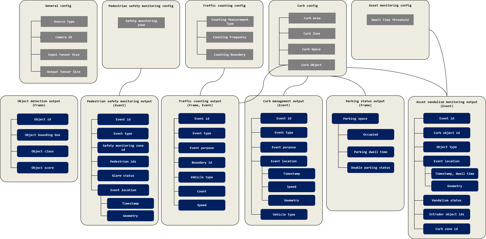

# Descriptions for standardized JSON output schema

This README describes the JSON output schema that we standardized for the AITRIOS AI model output. The current JSON output schema (v1.0.3) is primarily intended for DNN object detection and post-processing for smart city use-cases, such as traffic counting and curb management. It can be expanded to more use-cases and can be easily added to the main schema. 

Below is the link to the main schema files:
- [config_main_schema.json](https://github.com/smart-camera-engagement/eval-ai-models/blob/v1.0.3/schema/config_main_schema.json): config main schema to log configurations and settings of AI model and algorithm.
- [output_main_schema.json](https://github.com/smart-camera-engagement/eval-ai-models/blob/v1.0.3/schema/output_main_schema.json): output main schema for frame-based or event outputs

Below is an overview of each sub-schema configuration and its corresponding output file.

----

### config_main_schema.json
The 'config_main_schema.json' file consists of several subschemas: 'general_config', 'counting_config', 'curb_config', 'asset_config' and 'ped_config'.

#### 'general_config' object
| Field Name            | Required  | Data Type | Description |
|-----------------------|-----------|-----------|-------------|
| source_type           |   Y       | string    | Source type for data |
| camera_id             |   Y       | integer   | Camera id |
| video_file_name       |   N       | string    | Video file name; leave as 'null' if it's online processing |
| total_image_frames    |   N       | integer   | The number of total images for processing; leave as -1 if it's online processing |
| input_tensor_height   |   Y       | integer   | Input tensor size (height) |
| input_tensor_width    |   Y       | integer   | Input tensor size (width) |
| output_tensor_height  |   Y       | integer   | Output tensor size (height) |
| output_tensor_width   |   Y       | integer   | Output tensor size (width) |

#### 'counting_config' object
| Field Name            | Required  | Data Type | Description |
|-----------------------|-----------|-----------|-------------|
| counting_type   |   Y       | string   | Type of count measurement (supported types: "total", "peak", "average") |
| counting_interval   |   Y       | object   | Interval of count measurement (unit: "frame", "second", "minute") |
| counting_boundary   |   Y       | array   | Boundary configuration for traffic counting ([LineString](https://datatracker.ietf.org/doc/html/rfc7946#appendix-A.2) and [Polygon](https://datatracker.ietf.org/doc/html/rfc7946#appendix-A.3) are supported for geometry.)|

#### 'curb_config' object
| Field Name            | Required  | Data Type | Description |
|-----------------------|-----------|-----------|-------------|
| area   |   N       | array   | Area configuration for curb management |
| zone   |   Y       | array   | Zone configuration for curb management (example for curb_zone_id: "parking_zone_0", "parking_zone_1", "loading_zone_0", "loading_zone_1", "bike_lane_0", "bike_lane_1", "traffic_lane_0", "traffic_lane_1", "sidewalk_0", "sidewalk_1") |
| space   |   Y       | array   | Space configuration for curb management (example for curb_space_id: "parking_space_0", "parking_space_1", "parking_space_2", ...) |
| object   |   N       | array   | Object configuration for curb management |

#### 'asset_config' object
| Field Name            | Required  | Data Type | Description |
|-----------------------|-----------|-----------|-------------|
| dwell_time_threshold   |   N       | number   | Time threshold for the suspected person involved in vandalism [in seconds] |

#### 'ped_config' object
| Field Name            | Required  | Data Type | Description |
|-----------------------|-----------|-----------|-------------|
| zone   |   N       | array   | Zone configuration for pedestrian safety monitoring (zone id and geometry) |

### output_main_schema.json
The 'output_main_schema.json' file can be used for both frame-based output and event-based output. Frame-based output is primarily for internal evaluation purposes, while event-based output is intended for system integration with the dashboard. The main schema consists of several subschemas: 'detection_results', 'counting_results', 'parking_results' for frame-based outputs and 'curb_management_event', 'counting_event', 'asset_event' and 'ped_event' for event outputs. The descriptions for 'counting_results' and 'parking_results' are omitted in this document. Please take a look at a sample output file '[frame_output_sample.json](https://github.com/smart-camera-engagement/eval-ai-models/blob/v1.0.3/sample/frame_output_sample.json).'

| Field Name | Required  | Data Type | Description |
|------------|-----------|-----------|-------------|
| frame_id  |   Y       | integer    | Unique identifier for the frame |
| timestamp  |   N       | string    | The timestamp of the frame in ISO 8601 format |

#### 'detection_results' object
| Field Name | Required  | Data Type | Description |
|------------|-----------|-----------|-------------|
| object_id   |   Y       | array of integer   | List of detected objects in the frame |
| object_bbox    |   Y       | array     | Bounding box coordinates of the detected object [x1, y1, x2, y2] |
| object_class  |   Y       | array of string    | Type of the detected object (supported objects: "pedestrian", "bicycle", "cargo_bicycle", "car", "scooter", "moped", "motorcycle", "truck", "van", "freight", "other", "unspecified")|
| object_score       |   Y       | array of number    | Confidence score of the detected object |

----
### Version
|   Version  |   Date    | Description |
|------------|-----------|-------------|
| 1.0.0      | 11/6/2024 | First version created for DNN object detection output and smart city use-case |
| 1.0.1      | 11/15/2024 | Updated the main schema into separate subschemas depending on use-case |
| 1.0.2      | 12/20/2024 | Updated traffic counting schema and added asset monitoring schema |
| 1.0.3      | 01/28/2025 | Modified the schema not to use nested objects as UrbanLogiq's ingestion engine is not able to handle them, and added a new schema for pedestrian safety use-case |